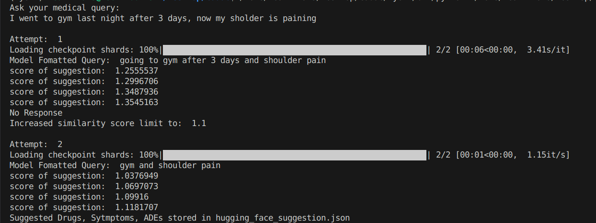

# Cadac Drug Suggestion Project

This project aims to suggest drug names, diseases/symptoms, and adverse drug events (ADEs) in response to medical-related queries using Hugging Face large language models (LLMs). When relevant data is found, the results are returned in a structured JSON format and saved to a file for further use.

## Approach

### 1: Data Extraction 

* Extracted annotated information from the CADEC dataset, available in the Cadac/Original directory.
* Parsed the .ann files and consolidated drug names, diseases, symptoms, and adverse drug reactions (ADRs) into separate columns in a structured CSV format.
* Each annotation file corresponds to one row in the CSV file.
* Output file: data_set.csv

### 2. Embeddings Creation

* Generated sentence embeddings for each row in data_set.csv.
* Embedding model used: sentence-transformers/all-mpnet-base-v2
* Output file: embeddings (in byte format)

### 3. Drug Suggestoin

* The user inputs a medical-related query to receive drug suggestions.
* Medical keywords/entities are extracted from the input using the model: phamhai/Llama-3.2-3B-Instruct-Frog.
* Cosine similarity is computed between the extracted keywords and the dataset embeddings.
* Initial similarity threshold is set to 0.9.
* If no relevant suggestions are found, the threshold is increased iteratively by 0.2 (up to three times).
* Once a match is found, the suggestions are saved in a structured JSON format.
* Output file: hugging_face_suggestion.json


### Key Features

* Modular and efficient pipeline for entity extraction, embedding comparison, and result generation.
* Robust fallback mechanism to ensure relevant suggestions even with loosely related queries.
* Designed for easy integration with medical NLP pipelines.


### Examples

**Example 1**

* **Query:** `I went to gym last night after 3 days, now my sholder is paining`

* **Response:**
    ```json
    {
        "Drug": [
            "arthrotec",
            "crestor",
            "lipitor",
            "tylenol3",
            "zocar"
        ],
        "Symptoms/Diseases": [
            "blockage",
            "shoulder pain",
            "torn rotator cuff"
        ],
        "ADEs": [
            "bowel/uterine cramping",
            "cramp",
            "cramping in back muscles",
            "cramping in calves",
            "cramping in hamstrings",
            "difficulty with memory",
            "inflammation",
            "losing strength",
            "pain",
            "severe abdominal pain",
            "severe back spasm",
            "severe muscle pain in shoulders",
            "severe pain",
            "shoulder pain"
        ]
    }
    ```
* **Example Output:**
